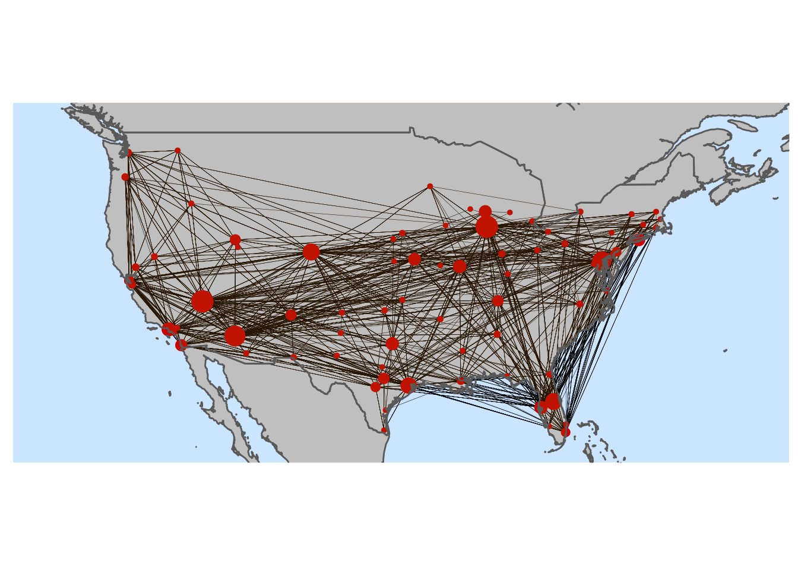

# ✈️ Flight Delay Prediction

An end-to-end machine learning project that predicts whether a US domestic flight will arrive late (**>15 minutes**, the FAA definition) and by **how many minutes** — using only information available *before* departure.

The project covers the full lifecycle:

1. **Exploratory data analysis** on ~7M flights from 2024
2. **Feature engineering**: smoothed target encoding plus airport-network (graph) features
3. **Model training**: two XGBoost models (a classifier and a regressor)
4. **Serving**: a FastAPI REST API
5. **Packaging & deployment**: Docker image → AWS ECR → AWS ECS Fargate

```
USER  → sends raw flight info (date, hour, route, carrier, distance)
  ↓
API   → validates input (Pydantic)
      → looks up engineered features from precomputed tables
      → feeds the feature vector to both models
      → returns delay probability + predicted delay minutes
  ↓   
DOCKER → bundles the API, models, and lookup tables into one image
  ↓   
AWS   → ECS Fargate task exposes the container publicly
```

---

## Table of Contents

- [Project Structure](#project-structure)
- [Dataset](#dataset)
- [Exploratory Data Analysis](#exploratory-data-analysis)
- [Feature Engineering](#feature-engineering)
- [Modeling](#modeling)
- [Results](#results)
- [API](#api)
- [Running Locally](#running-locally)
- [Docker](#docker)
- [Deployment on AWS](#deployment-on-aws)
- [Limitations & Next Steps](#limitations--next-steps)

---

## Project Structure

```
flight_delay_prediction/
├── app.py                          # FastAPI service (loads models + lookups, serves /predict)
├── Dockerfile                      # python:3.11-slim image running uvicorn on :8000
├── .dockerignore                   
├── requirements.txt                
├── models/
│   ├── classification_model.json   # XGBoost classifier (is_delayed)
│   ├── regressor.json              # XGBoost regressor (arr_delay minutes)
│   └── feature_lookups.json        # precomputed encodings used at inference time
├── notebooks/
│   └── notebook.ipynb              # EDA, feature engineering, training, export
├── deploy/
│   ├── task-definition.json        # ECS Fargate task definition
│   └── iam-policy.json             # IAM permissions needed to push & deploy
├── images/                         # figures used in the notebook / README
└── data/                           # (git-ignored) raw CSV + parquet checkpoints
```

---

## Dataset

US DOT / Bureau of Transportation Statistics **On-Time Performance** data for calendar year **2024**.

| | |
|---|---|
| Raw rows | **7,079,081** flights |
| Columns | 35 (schedule, actual times, delays by cause, cancellation/diversion flags, …) |
| Carriers | 15 |
| Airports | 348 |
| Unique routes | 6,792 |

The raw file (`data/flight_data_2024.csv`, ~1.3 GB) isn't committed. Put it in `data/` to re-run the notebook.

### Cleaning

- **Nulls are structural.** Every null in the departure columns (`dep_time`, `dep_delay`, `taxi_out`, `wheels_off`) belongs to a **cancelled** flight. The remaining unexplained nulls in arrival columns (`wheels_on`, `taxi_in`, `arr_*`) all belong to **diverted** flights.
- Cancelled and diverted flights are dropped because they have no arrival delay to learn from and can't be imputed meaningfully. That leaves **6,965,266** flights.
- **Target definitions:**
  - `is_delayed = arr_delay > 15` → **20.1%** positive class 
  - `arr_delay` (minutes, negative = early) → regression target

---

## Exploratory Data Analysis

Key findings from the notebook:

- **Hour of day is the strongest signal.** The delay rate drops around 05:00, then climbs steadily through the day and peaks around 19:00. That's consistent with delays **cascading** through an aircraft's daily rotation.
- **Month matters:** there are peaks in summer and around the holidays.
- **Carrier matters:** the delay rate of the worst carrier is about **2×** that of the best.
- **Airports and routes differ a lot** in delay rate, but many have few flights, so their raw means are noisy (handled with smoothing, below).
- **Raw numeric features** (distance, scheduled elapsed time) have almost no linear relationship with delay on their own. Most of the predictive power comes from aggregated and interaction features.
- Origin and destination delay rates are only weakly correlated, so each carries **independent information**.

### Correlation analysis vs. `arr_delay`

Three complementary measures were used: Pearson (linear), Spearman (monotonic), and Mutual Information (any dependency, on a 500k-row sample).

| Feature | Pearson | Spearman | Mutual Info |
|---|---:|---:|---:|
| `dep_hour` | 0.101 | 0.165 | 0.022 |
| `route_delay_rate` | 0.091 | 0.136 | **0.044** |
| `carrier_delay_rate` | 0.070 | 0.083 | 0.021 |
| `origin_delay_rate` | 0.055 | 0.080 | 0.026 |
| `dest_delay_rate` | 0.047 | 0.051 | 0.016 |
| `origin_pagerank` | 0.020 | 0.059 | 0.027 |
| `distance` | -0.006 | -0.012 | 0.028 |
| `month` | -0.027 | -0.037 | 0.012 |

`distance` is useless linearly but carries some non-linear information. Mutual information picks that up and correlation doesn't.

---

## Feature Engineering

### 1. Smoothed target encoding (empirical Bayes)

High-cardinality categoricals (airports, routes, carriers) are replaced by their **smoothed delay rate**:

$$
\text{rate}_{\text{smoothed}} = \frac{n \cdot \bar{y}_{\text{group}} + m \cdot \bar{y}_{\text{global}}}{n + m}
$$

Groups with few flights are pulled toward the global mean, so a small airport with 3 flights and 2 delays doesn't get a 67% delay rate. The smoothing strength is `m = 100` for origin/destination/carrier and `m = 200` for routes.

### 2. Airport network features (NetworkX)

The flight network is modeled as a **directed weighted graph**:

- **Nodes** are airports
- **Edges** are routes (origin → destination)
- **Weight** is the number of flights on the route



These centrality measures were computed: degree, in/out-degree, betweenness, and **PageRank**. The top hubs by PageRank are DFW, DEN, ATL, ORD, and CLT. Delay rate increases with origin PageRank quartile (Q1: 17.8% → Q4: 22.6%).

Degree, betweenness, and PageRank are highly collinear (ρ ≈ 0.85–0.96), so only **PageRank** was kept.

### 3. Leakage-aware feature selection

39 columns were dropped, in these groups:

| Group | Examples | Reason |
|---|---|---|
| **Leakage** | `dep_time`, `dep_delay`, `taxi_out`, `wheels_off/on`, `air_time`, `*_delay` causes | Only known *after* the flight departs |
| Redundant | `crs_dep_time`, `crs_arr_time`, `crs_elapsed_time`, `fl_date`, `year` | Duplicated by kept features |
| Encoded away | `origin`, `dest`, `op_unique_carrier`, `route`, city/state names | Replaced by target encodings |
| Redundant graph | `*_degree`, `*_betweenness`, `*_in_degree` | Collinear with PageRank |

### Final feature set (12 features)

| Feature | Description |
|---|---|
| `month`, `day_of_month`, `day_of_week` | Calendar |
| `dep_hour` | Scheduled departure hour (local) |
| `distance` | Route distance in miles |
| `origin_delay_rate`, `dest_delay_rate` | Smoothed airport delay rates |
| `carrier_delay_rate` | Smoothed carrier delay rate |
| `route_delay_rate` | Smoothed origin→destination delay rate |
| `origin_pagerank`, `dest_pagerank` | Airport importance in the network |
| `origin_flight_count` | Origin airport traffic volume |

---

## Modeling

### Time-based split

A random split would let the model "see the future", so the data is split **chronologically**:

| Split | Months | Rows | Delay rate |
|---|---|---:|---:|
| Train | Jan – Oct | 5,808,501 | 20.7% |
| Test | Nov – Dec | 1,156,765 | 17.3% |

### Models

| Task | Model | Notes |
|---|---|---|
| Classification (`is_delayed`) | `XGBClassifier` | 300 trees, max depth 6, `scale_pos_weight ≈ 3.83` for class imbalance |
| Regression (`arr_delay`) | `XGBRegressor` | 300 trees, max depth 6 |

Both models are exported in XGBoost's native **JSON** format.

---

## Results

Evaluated on the Nov–Dec holdout set (1,156,765 flights).

### Classification — is the flight delayed > 15 min?

| Model | Accuracy | Precision | Recall | F1 | ROC-AUC |
|---|---:|---:|---:|---:|---:|
| Baseline (always "on time") | 0.827 | — | 0.000 | 0.000 | 0.500 |
| **XGBoost** | 0.771 | 0.282 | 0.207 | **0.238** | **0.623** |

### Regression — how many minutes late?

| Model | MAE | RMSE | R² |
|---|---:|---:|---:|
| Baseline (predict train mean) | 26.30 min | 52.98 min | ~0 |
| **XGBoost** | **22.45 min** | 52.62 min | 0.007 |

### Feature importance (gain)

| Rank | Classifier | Regressor |
|---|---|---|
| 1 | `dep_hour` (0.30) | `route_delay_rate` (0.19) |
| 2 | `route_delay_rate` (0.25) | `dep_hour` (0.18) |
| 3 | `month` (0.10) | `month` (0.13) |
| 4 | `carrier_delay_rate` (0.08) | `carrier_delay_rate` (0.12) |
| 5 | `day_of_month` (0.06) | `day_of_month` (0.10) |

### Interpretation

Predicting delays from **schedule-only** features is hard. Most delay variance comes from things you don't know at booking time: weather, air traffic control, and late-arriving aircraft. The models do beat the baselines: the classifier is clearly better than chance (AUC 0.62), and the regressor cuts MAE by about 15%. Even so, the results confirm that **real-time signals are needed** for strong performance (see [Next Steps](#limitations--next-steps)).

---

## API

Built with **FastAPI**. At startup, a `lifespan` handler loads both models and the lookup tables into `app.state` once, and every request shares them.

| Method | Endpoint | Description |
|---|---|---|
| `GET` | `/` | Service info |
| `GET` | `/health` | Health check (used by the ECS container health check) |
| `POST` | `/predict` | Predict delay for one flight |
| `GET` | `/docs` | Interactive Swagger UI |

### Request

```json
POST /predict
{
  "month": 7,
  "day_of_week": 5,
  "day_of_month": 19,
  "dep_hour": 18,
  "distance": 2475,
  "origin": "JFK",
  "dest": "LAX",
  "carrier": "AA"
}
```

| Field | Type | Notes |
|---|---|---|
| `month` | int | 1–12 |
| `day_of_week` | int | 1 = Monday … 7 = Sunday |
| `day_of_month` | int | 1–31 |
| `dep_hour` | int | Scheduled local departure hour, 0–23 |
| `distance` | float | Miles |
| `origin`, `dest` | str | IATA airport codes, e.g. `ATL` |
| `carrier` | str | BTS carrier code, e.g. `AA`, `DL`, `WN` |

### Response

```json
{
  "is_delayed": true,
  "delay_probability": 0.82,
  "predicted_delay_minutes": 40.3,
  "input": { "month": 7, "day_of_week": 5, "day_of_month": 19, "dep_hour": 18, "distance": 2475.0, "origin": "JFK", "dest": "LAX", "carrier": "AA" }
}
```

### How unseen values are handled

If an airport, carrier, or route isn't in the lookup tables, the API falls back to safe defaults instead of failing:

- Delay rates fall back to the **global delay rate** (~0.201)
- PageRank falls back to `0.001`
- Flight count falls back to `100`

The feature vector is always reordered to match the column order the booster was trained on.

---

## Running Locally

```bash
python -m venv .venv
source .venv/bin/activate
pip install -r requirements.txt
uvicorn app:app --reload --port 8000
```

Then open http://localhost:8000/docs, or:

```bash
curl -X POST http://localhost:8000/predict -H "Content-Type: application/json" -d '{"month":7,"day_of_week":5,"day_of_month":19,"dep_hour":18,"distance":2475,"origin":"JFK","dest":"LAX","carrier":"AA"}'
```

To reproduce the analysis and training, install the notebook extras (`seaborn`, `matplotlib`, `networkx`, `pyarrow`, `jupyter`), put the raw CSV in `data/`, and run `notebooks/notebook.ipynb`.

---

## Docker

The image is based on `python:3.11-slim` and contains only `app.py`, `models/`, and the dependencies. `.dockerignore` excludes the data, notebooks, and virtual environment.

```bash
docker build -t flight-delay-api .
docker run -p 8000:8000 flight-delay-api
```
---


## Limitations & Next Steps

**Known limitations**

- **Target-encoding leakage in evaluation.** The delay-rate encodings and lookup tables were computed on the full year, including the Nov–Dec test months. The reported test metrics are therefore somewhat optimistic. Computing encodings on the training split only would give a cleaner estimate.
- **Default 0.5 decision threshold.** The classifier's threshold hasn't been tuned. Choosing it from a precision–recall curve could trade precision for recall as needed.
- **Distribution shift.** The test months (Nov–Dec) have a lower delay rate (17.3%) than the training months (20.7%).
- **No input validation ranges.** For example, `month=13` or `dep_hour=25` are currently accepted.
- **US domestic flights in 2024 only.**

**Possible improvements**

- Add **weather** data (METAR/TAF at origin and destination) and **holiday** indicators
- Add **aircraft rotation / late-arriving aircraft** features (previous leg delay for the tail number)
- Add airport congestion features (scheduled departures per hour at origin)
- Hyperparameter tuning with time-series cross-validation (e.g. Optuna)
- Use a quantile or Tweedie objective for the heavy-tailed delay-minutes target
- Move training into a reproducible script or pipeline, with experiment tracking (MLflow)
- Add tests and CI/CD (GitHub Actions → ECR → ECS), plus an Application Load Balancer and HTTPS in front of the service

---

## Tech Stack

**Data & ML:** pandas, NumPy, scikit-learn, XGBoost, NetworkX, seaborn, matplotlib
**Serving:** FastAPI, Pydantic, Uvicorn
**Infra:** Docker, AWS ECR, AWS ECS Fargate, CloudWatch, IAM